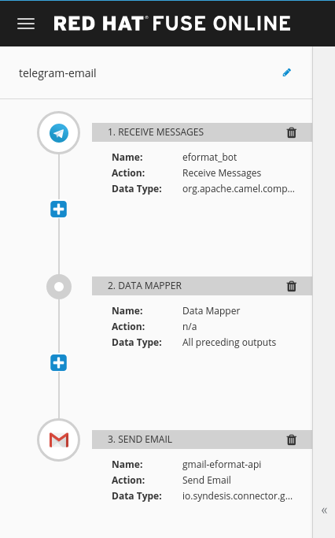

### Telegram to Gmail using Fuse Online (Syndesis.io)

- you need a running OpenShift

Install fuse online (see https://syndesis.io/quickstart/)

```bash
wget https://raw.githubusercontent.com/syndesisio/fuse-online-install/1.5/install_ocp.sh
chmod 755 install_ocp.sh

# install crd
oc login -u system:admin
./install_ocp.sh --setup

# if using another user, grant them access
./install_ocp.sh --grant developer --cluster

# setup a project and install
oc new-project fuse-online --display-name="Fuse Online"
./install_ocp.sh
```

Install Telegram messaging on your mobile / desktop, login with your mobile number

```bash
# https://fedoramagazine.org/telegram-in-fedora/

dnf install telegram-desktop
```

Create a Telegram Bot using the @BotFather

```bash
# bots
# https://core.telegram.org/bots
# https://medium.com/@unnikked/how-to-create-your-first-telegram-bot-9005c08a5aa5

@BotFather
/newbot

# my example bot is called @eformat_bot - calls your something else!
```


You will get a Telegram auth token when you setup your bot - use this to configure a Telegram Connection to your bot in Fuse Online


Create an API Oauth2 Web App Login for your gmail account

```bash
# https://access.redhat.com/documentation/en-us/red_hat_fuse/7.1/html/connecting_fuse_online_to_applications_and_services/connecting-to-gmail
# https://console.developers.google.com

# In Fuse Online goto Settings -> OUATH to retrieve your callback URL
# you need this to configure Gmail OAuth
https://syndesis-fuse-online.apps.eformat.me/settings/oauth-clients

# Get you ClientID and Client Secret from Google, and configure the Gmail Connector
```


Create your integration GMail Connection


You should now have two connections configured


Create an Integration using these (Receive from Telegram, Send to Gmail)



With a Data Mapper

> Note: that i set my to: email address statically in the connector (not in the mapper)


Hit Publish (this takes a minute or two to pull the S2I image and build/deploy your integration app)


You can connect to the Hawt.io console on the pod once it is deployed to see the FIS camel route as well


and now try it out ! Type in a message to Telegram and you should get an email delivered:


Basic activity and metrics reported in Fuse Online


